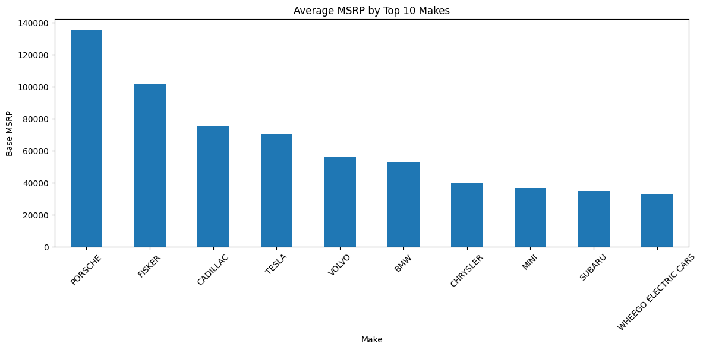
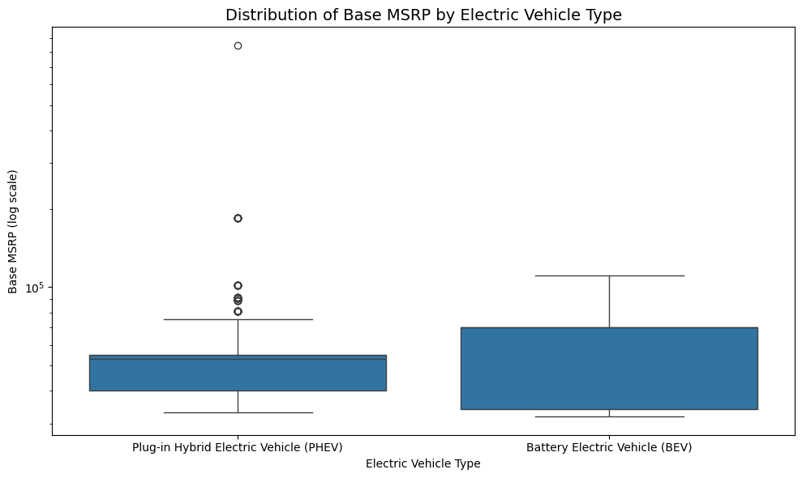
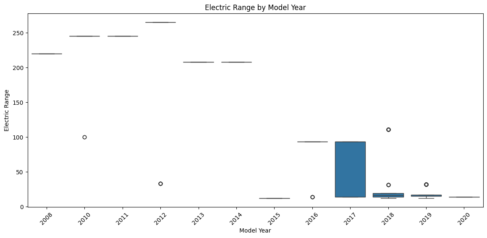
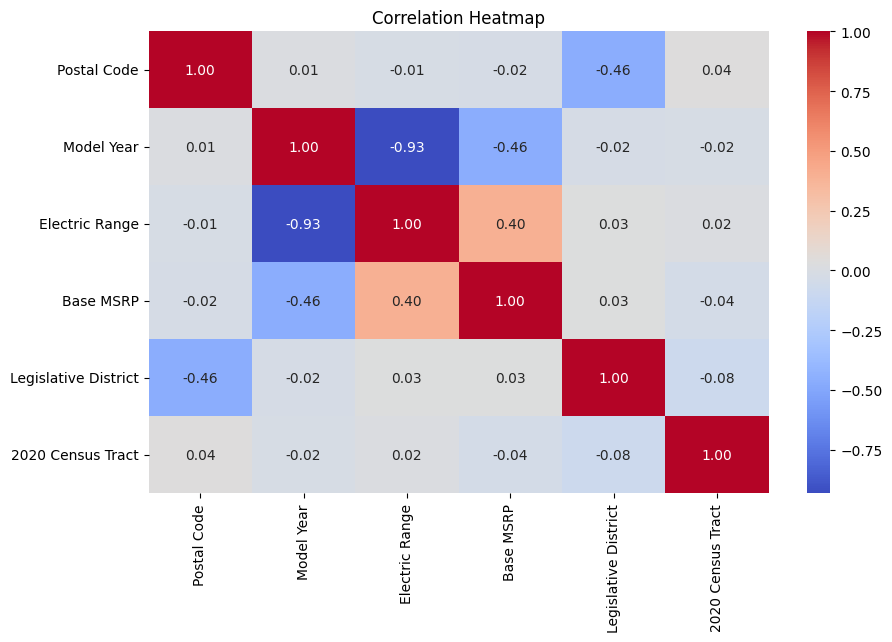

# 2025_ia651_puthenveettil

Code for 2025 IA651 Final Project.
#### Created by : Prasannan Ashwin Puthenveettil

# Project Title: Predicting Electric Vehicle MSRP(Manufacturer's Suggested Retail Price) and Range Using Machine Learning

## Table of Contents

- [Project Overview](#project-overview)
- [Dataset](#dataset)
- [Features](#features)
- [Data Preprocessing](#data-preprocessing)
- [EDA & Visualizations](#eda--visualizations)
- [Modeling](#modeling)
- [Results](#results)
- [Overfitting & Underfitting](#overfitting--underfitting)
- [Production Considerations](#production-considerations)
- [Future Improvements](#future-improvements)
- [Acknowledgment](#acknowledgment)

## Project Overview
This project explores electric vehicle adoption patterns using the Washington State Department of Licensing’s Electric Vehicle Population dataset. The goal is to develop two predictive models:

### 1: Predicting `BaseMSRP`
- Predict the **Base Manufacturer's Suggested Retail Price** of an electric vehicle.
- Useful for consumers, dealerships, and pricing analytics.

### 2: Predicting `Electric Range`
- Predict the **Electric Range** (in miles) of the vehicle on a full charge.
- Useful for consumers comparing EV performance and for manufacturers benchmarking efficiency.

##  Dataset

The project uses the [Washington State DOL Open Data](https://catalog.data.gov/dataset/electric-vehicle-population-data), containing real-world data on electric vehicles (EVs), including specifications like make, model, electric range, base MSRP, and classification attributes.
- **File**: `Electric_Vehicle_Population_Data.csv`

---

## Features

| Feature Name | Description |
|--------------|-------------|
| Model Year | Year of manufacture |
| Make | Manufacturer (e.g., TESLA) |
| Model | Specific vehicle model (e.g., MODEL S) |
| Electric Vehicle Type | BEV or PHEV |
| CAFV Eligibility | Clean fuel eligibility status |
| Electric Utility | Utility company serving EV |
| Base MSRP | Manufacturer Suggested Retail Price (target 1) |
| Electric Range | Range per charge (target 2) |

  
This dataset is useful for understanding factors affecting EV pricing and range, which has implications in sustainability, EV adoption strategies, and cost prediction models.

---

## Data Preprocessing
- Removed irrelevant columns (e.g., `VIN`, `DOL Vehicle ID`)
- Replaced 0s in `Base MSRP` and `Electric Range` with NaNs
- Handled missing values using `.dropna()`
- Applied **OneHotEncoding** for categorical variables
- Applied **StandardScaler** to numerical columns
- Created a **ColumnTransformer** for combined preprocessing

---

##  Exploratory Data Analysis (EDA)

### Prediction Task
- **Type**: Regression
- **X variables**: Multiple numerical and categorical fields like `Electric Range`, `Vehicle Class`, `Electric Utility`, etc.
- **Y variables**: Two separate targets:
  - `BaseMSRP`
  - `Electric Range`

###  Observations
- Dataset size: ~1300+ entries
- Several categorical fields needed encoding
- Feature-target relationships showed **moderate to strong correlation** for select features

###  Visualizations

#### Average MSRP by Top 10 Makes

#### Distribution of Base MSRP by Electric Vehicle Type

#### Electric Range by Model Year

#### Top 10 Most Common EV Models

#### Correlation Matrix

---

## Modeling
Tested several models on both targets:

- **Linear Regression**
- **Ridge Regression**
- **Lasso Regression**
- **Decision Tree**
- **Random Forest**
- **Gradient Boosting**
- **Support Vector Regressor (SVR)**

Iteratively refined models by:
- Removing irrelevant or ID fields
- Handling categorical columns using One-Hot Encoding
- Trying various regressors and hyperparameter settings via `GridSearchCV`

## Results

###  Evaluation Metrics
- **Primary Metric**: R² Score
- **Supporting Metrics**: MAE and RMSE
- Evaluated on the 20% held-out test set

---

###  Base MSRP Prediction

| Model             | R² Score | MAE       | RMSE      |
|------------------|----------|-----------|-----------|
| Random Forest     | 0.999971 | 3.76      | 92.53     |
| Gradient Boosting | 0.999625 | 97.87     | 331.95    |
| Decision Tree     | 0.999153 | 209.98    | 499.11    |
| Lasso Regression  | 0.996760 | 683.23    | 976.20    |
| Linear Regression | 0.996643 | 696.75    | 993.61    |
| Ridge Regression  | 0.990813 | 927.29    | 1643.81   |
| SVR               | 0.910664 | 946.40    | 5125.91   |

---

###  Electric Range Prediction

| Model                     | R² Score | MAE       | RMSE     | Params                      |
|---------------------------|----------|-----------|----------|-----------------------------|
| Decision Tree             | 1.000000 | 0.000000  | 0.000000 | {'regressor__max_depth': 10}|
| Random Forest             | 1.000000 | 0.000123  | 0.003138 | Default                     |
| Gradient Boosting         | 0.999999 | 0.049536  | 0.078397 | Default                     |
| Linear Regression         | 0.995325 | 3.514502  | 6.168106 | Default                     |
| Lasso Regression          | 0.989041 | 4.906823  | 9.443428 | {'regressor__alpha': 0.1}   |
| Ridge Regression          | 0.988828 | 5.779479  | 9.619888 | {'regressor__alpha': 10}    |
| SVR                       | 0.953821 | 10.889840 | 19.385423| Default                     |

---

## Overfitting & Underfitting

- **Decision Tree** and **Random Forest** showed perfect scores on Electric Range, indicating potential overfitting.
- **Regularization models** like Lasso and Ridge generalized better on MSRP.
- GridSearchCV and cross-validation scores helped detect and avoid underfitting in ensemble models.

---

##  Production Considerations

- Save the trained pipeline using `joblib` for deployment.
- Ensure consistent preprocessing steps (e.g., one-hot encoding, scaling) during inference.
- Watch for unseen categories in `Model`, `Make`, or `Electric Utility`.
- Consider monitoring model drift over time and retraining periodically with updated EV data.

---

##  Future Improvements

- Incorporate features like battery capacity, charging time, and EPA rating.
- Add NLP embeddings or grouping logic for `Make` and `Model` names.
- Include economic indicators or regional data for MSRP variation.
- Extend analysis to predict resale value or lifetime cost.

---

##  Acknowledgment

This project was built using the [Electric Vehicle Population Data](https://catalog.data.gov/dataset/electric-vehicle-population-data) provided by Washington State Department of Licensing.
